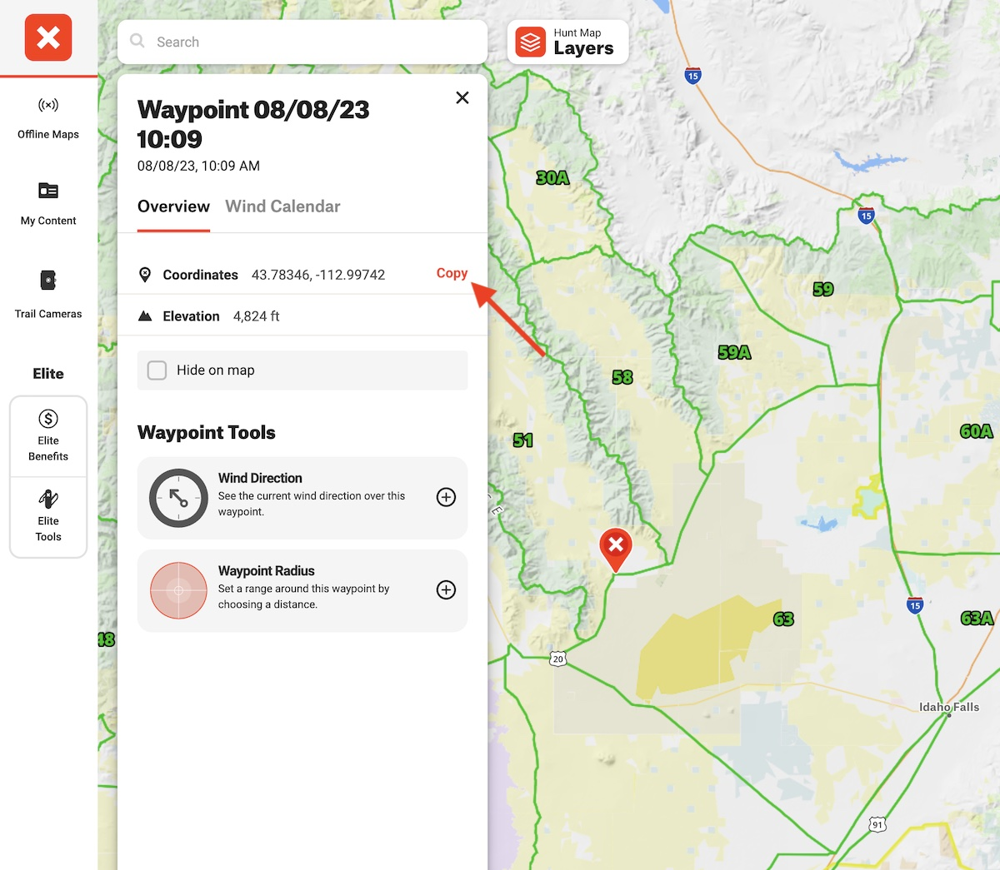
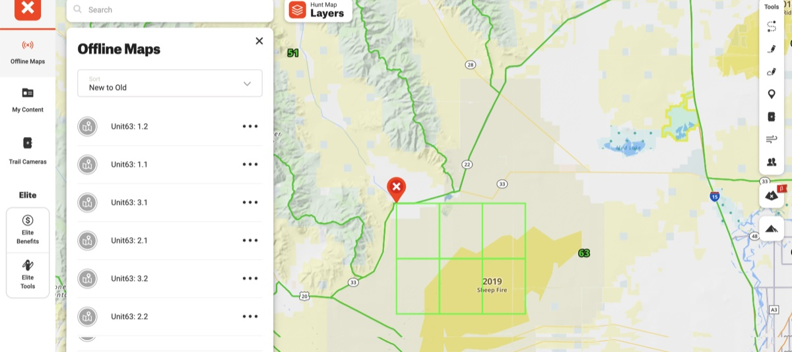

# onX Maps Grid Builder

This is a tool to generate a grid of offline maps for use in the onX Maps app. It is a command line tool that takes a location (latitude, longitude) as the upper left corner, and generates a
grid based on the specified columns and rows.

## Usage

Clone the repo and run `npm install` to install dependencies.

### Authentication

You will need to set a `TOKEN` environment variable, which should be a current Bearer token. You can use your browser's developer tools to get this token from the onX Maps app. Do not add the `Bearer` prefix to the token. You can either export this variable (eg. (`export TOKEN=ey70c7599d...`) in the terminal session where you will run the tool, OR you can create a `.env` file in the root of the project and add the token there.

_`.env` file example_

```txt
TOKEN=ey70c7599d...
```

### Running the Tool

Use the onX tool to drop a waypoint that represents the upper left corner of the grid you want to generate. Copy the latitude and longitude from the waypoint and use them as the location argument.



The tool takes the following required arguments:

| Argument           | Description                                                      |
| ------------------ | ---------------------------------------------------------------- |
| `-l`, `--location` | The latitude and longitude of the upper left corner of the grid. |
| `-n`, `--name`     | The prefix to use for the name of each offline map.              |
| `-c`, `--columns`  | The number of columns to generate.                               |
| `-r`, `--rows`     | The number of rows to generate.                                  |

#### Example

```
npx ts-node src/index.ts --name Unit63 --location "43.78346, -112.99742" -c 3 -r 2
```

or

```
npx ts-node src/index.ts -n Unit63 -l "43.78346, -112.99742" -c 3 -r 2
```

After successfully running the tool, you'll need to refresh your browser window and click
on the offline maps icon to see the new maps.


